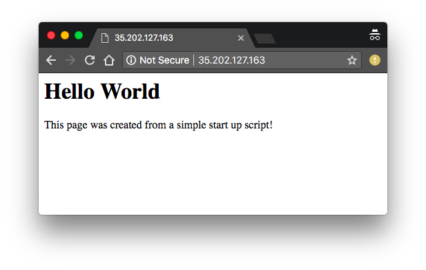

# Create VM with a startup script

This sample simply starts a new VM and lists all VMs in zone `us-central1-a`.
The newly created VM runs the script that we provide at startup. The startup script installs
Apache and a custom homepage.

### Before you begin

Before running the samples, make sure you've followed the steps in the
[Before you begin section](../../README.md#before-you-begin) of the client
library's README and that your environment variable
`GOOGLE_APPLICATION_CREDENTIALS` is set.

### Run the sample

```
git clone git@github.com:googleapis/nodejs-compute.git
cd nodejs-compute/samples/create-with-startup-script
npm install
npm start
```

On success, you should see output like this:

```
$ npm start

> compute-using-the-client-library@1.0.0 start /Users/franzih/code/gcp/compute-using-the-client-library-sample1
> node index.js

ubuntu-http91: 35.192.234.198
ubuntu-http7: 35.184.205.70
ubuntu-http77 created, running at 35.184.157.25
Waiting for startup...
.........................Ready!
```

You can test the new VM in your browser by navigating to its IP address.





### Troubleshooting

As you have full control over Compute Engine instances, you can
`ssh` into the VM that the script created. Then you can
make any changes you want and have a look at the log files.

`gcloud compute --project "YOUR PROJECT ID" ssh --zone "us-central1-a" "ubuntu-http-NUMBER"`

If the start up script doesn’t work (it takes about two
minutes to install Apache), `ssh` into
the VM and check the log files in `/var/log/syslog`. Keep in
mind that the startup script is run as root with a different
home directory than your default user.